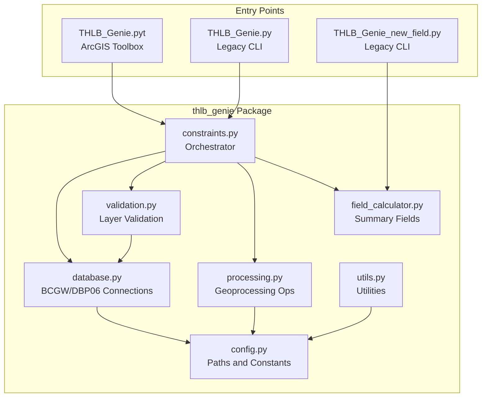
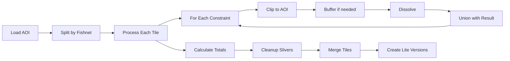

# THLB Genie

A Python toolbox for ArcGIS Pro that processes Timber Harvesting Land Base (THLB) and Crown Forest Land Base (CFLB) constraints to determine harvestable forest areas.

## Table of Contents

- [Overview](#overview)
- [Prerequisites and Requirements](#prerequisites-and-requirements)
- [Installation and Setup](#installation-and-setup)
- [Usage Guide](#usage-guide)
  - [THLB Genie Tool](#thlb-genie-tool)
  - [THLB New Field Calculator](#thlb-new-field-calculator)
- [Excel Template Documentation](#excel-template-documentation)
- [Architecture](#architecture)
- [Processing Workflow](#processing-workflow)
- [Troubleshooting](#troubleshooting)
- [Example Use Cases](#example-use-cases)

---

## Overview

### What is THLB and CFLB?

- **THLB (Timber Harvesting Land Base)**: The portion of the total forest land base where timber harvesting is considered both acceptable and economically feasible. Areas are excluded from THLB based on various constraints such as parks, wildlife habitat, steep slopes, riparian zones, etc.

- **CFLB (Crown Forest Land Base)**: Crown-owned forested land that may have fewer restrictions than THLB. Some areas may be CFLB but not THLB due to additional harvesting constraints.

### What Does THLB Genie Do?

THLB Genie automates the process of analyzing an Area of Interest (AOI) against multiple constraint layers defined in an Excel spreadsheet. For each constraint, it:

1. Clips the constraint layer to your AOI
2. Applies optional buffers (e.g., riparian setbacks)
3. Dissolves overlapping features
4. Unions all constraints together
5. Classifies each polygon as `Y` (available) or `N` (excluded) for each constraint
6. Calculates summary fields (`THLB_Total`, `CFLB_Total`)
7. Cleans up slivers and small polygons
8. Optionally creates simplified "Lite" versions which dissolves based on the THLB and CFLB fields

### Included Tools

| Tool | Description |
|------|-------------|
| **THLB Genie** | Main constraint processing tool - processes AOI against constraint layers |
| **THLB New Field Calculator** | Creates custom summary fields from existing constraint results |

---

## Prerequisites and Requirements

### Software Requirements

- **ArcGIS Pro** 2.9 or later with Python 3.x
- **Python packages** (included with ArcGIS Pro):
  - `pandas`
  - `openpyxl`
  - `arcpy`

### Database Connections

The tool requires access to two database connections:

| Connection | Location | Description |
|------------|----------|-------------|
| **BCGW.sde** | `Database Connections\BCGW.sde` | BC Geographic Warehouse - provincial spatial data |
| **DBP06.sde** | `F:\south_root\GIS_Workspace\Scripts_and_Tools\THLB_Genie\Supporting_files\DBP06.sde` | Internal database for additional layers |

### Supporting Files

The tool expects supporting files at the following locations:

```
Repo\
└── Supporting_data.gdb\
    └── Provincial_fishnet       # Grid for splitting large AOIs

F:\south_root\GIS_Workspace\Scripts_and_Tools\THLB_Genie\Supporting_files\
└── DBP06.sde                    # Database connection file
```

---

## Installation and Setup

### Step 1: Copy or Clone the Repository

Copy the `Repo` folder to your local machine or access it from the network location:

```
F:\south_root\GIS_Workspace\Scripts_and_Tools\THLB_Genie\Repo\
```

### Step 2: Set Up Database Connections

1. **BCGW Connection**:
   - In ArcGIS Pro, go to **Insert > Connections > New Database Connection**
   - Connect to BCGW and save as `BCGW.sde` in your Database Connections folder

2. **DBP06 Connection**:
   - Ensure `DBP06.sde` exists in the `Supporting_files` folder
   - Verify the connection is active before running the tool

### Step 3: Add the Toolbox to ArcGIS Pro

1. Open ArcGIS Pro
2. In the **Catalog** pane, right-click **Toolboxes**
3. Select **Add Toolbox**
4. Navigate to the repository and select `THLB_Genie.pyt`

### Step 4: Verify Supporting Data

Ensure the Provincial fishnet feature class exists in the Repo folder:
```
Repo\Supporting_data.gdb\Provincial_fishnet
```

This fishnet is used to split large AOIs into manageable tiles for processing.

---

## Usage Guide

### THLB Genie Tool

The main tool for processing THLB/CFLB constraints.

#### Parameters

| Parameter | Type | Required | Default | Description |
|-----------|------|----------|---------|-------------|
| **Output Location** | Folder | Yes | - | Directory where results will be saved |
| **Output File Name** | String | Yes | `THLB_Output` | Name prefix for the output folder |
| **Area of Interest** | Polygon Feature Layer | Yes | - | The boundary to analyze |
| **AOI SQL Query** | SQL Expression | No | - | Optional filter to subset the AOI |
| **Constraints Excel File** | .xlsx File | Yes | - | Excel file defining constraints to process |
| **Run Layer Validation** | Boolean | No | `False` | Validate all layers before processing |
| **Create Lite Version** | Boolean | No | `True` | Create dissolved summary outputs |

#### Output

The tool creates a dated output folder with the following structure:

```
THLB_Genie_{OutputFileName}_{YYYY_MM_DD}\
└── THLB_Genie.gdb\
    ├── AOI                 # Copy of your input AOI
    ├── THLB_Final          # Full result with all constraint fields
    ├── THLB_Lite           # Dissolved by THLB_Total (optional)
    └── CFLB_Lite           # Dissolved by CFLB_Total (optional)
```

#### Output Fields

The `THLB_Final` feature class contains:

- **Constraint fields** (e.g., `THLB_OGMA`, `CFLB_Parks`): `Y` or `N` for each constraint
- **THLB_Total**: `Y` if all THLB and CFLB constraints are `Y`, otherwise `N`
- **CFLB_Total**: `Y` if all CFLB constraints are `Y`, otherwise `N`

---

### THLB New Field Calculator

Creates custom summary fields based on existing constraint results.

#### Parameters

| Parameter | Type | Required | Default | Description |
|-----------|------|----------|---------|-------------|
| **Input THLB Dataset** | Polygon Feature Layer | Yes | - | Output from THLB Genie (e.g., `THLB_Final`) |
| **New Field Name** | String | Yes | `Custom_Total` | Name for the new summary field |
| **Fields to Exclude** | Field List | No | - | Constraint fields to ignore in calculation |
| **CFLB Only Mode** | Boolean | No | `False` | Only consider CFLB-prefixed fields |

#### How It Works

The calculator examines all `THLB_*` and `CFLB_*` fields (or just `CFLB_*` in CFLB Only Mode):
- If **any** field contains `N`, the new field is set to `N`
- If **all** fields contain `Y`, the new field is set to `Y`

#### Use Case

After running THLB Genie, you may want to create a custom summary that excludes certain constraints. For example, to see what areas would be available if OGMAs were removed:

1. Run THLB New Field Calculator
2. Set **New Field Name** to `THLB_No_OGMA`
3. Add `THLB_OGMA` to **Fields to Exclude**

---

## Excel Template Documentation

The constraints Excel file (`THLB_Genie_Template.xlsx`) defines which layers to process and how.

### Required Columns

| Column | Required | Description | Example |
|--------|----------|-------------|---------|
| **Feature Name** | Yes | Full feature class name in the database | `WHSE_LAND_USE_PLANNING.RMP_OGMA_LEGAL_CURRENT_SVW` |
| **Feature Name Short** | Yes | Abbreviated name for output field (max 10 chars recommended) | `OGMA` |
| **Data Source** | Yes | Database source: `BCGW`, `DBP06`, or `LOCAL` | `BCGW` |
| **CFLB_THLB** | Yes | Classification type: `CFLB` or `THLB` | `THLB` |
| **Definition Query** | No | SQL expression to filter the layer | `LEGAL_OGMA_PROVID IS NOT NULL` |
| **Buffer Distance** | No | Buffer distance with units | `100 Meters` |

### Example Rows

| Feature Name | Feature Name Short | Data Source | CFLB_THLB | Definition Query | Buffer Distance |
|--------------|-------------------|-------------|-----------|------------------|-----------------|
| `WHSE_TANTALIS.TA_PARK_ECORES_PA_SVW` | `Parks` | BCGW | CFLB | `PROTECTED_LANDS_DESIGNATION = 'PARK'` | |
| `WHSE_LAND_USE_PLANNING.RMP_OGMA_LEGAL_CURRENT_SVW` | `OGMA` | BCGW | THLB | | |
| `WHSE_FOREST_VEGETATION.VEG_BURN_SEVERITY_SP` | `Fire` | BCGW | THLB | `BURN_SEVERITY_RATING = 'High'` | |
| `WHSE_BASEMAPPING.FWA_STREAM_NETWORKS_SP` | `Streams` | BCGW | THLB | `STREAM_ORDER >= 3` | `30 Meters` |

### Field Naming Convention

The output field name is created by combining `CFLB_THLB` and `Feature Name Short`:
- `CFLB` + `Parks` = `CFLB_Parks`
- `THLB` + `OGMA` = `THLB_OGMA`

### Data Source Options

| Source | Description |
|--------|-------------|
| `BCGW` | BC Geographic Warehouse (via BCGW.sde connection) |
| `DBP06` | Internal database (via DBP06.sde connection) |
| `LOCAL` | Local file path (provide full path in Feature Name column) |

---

## Architecture

### Project Structure

```
Repo/
├── THLB_Genie.pyt              # ArcGIS Python Toolbox (main entry point)
├── THLB_Genie.py               # Legacy command-line entry point
├── THLB_Genie_new_field.py     # Legacy entry point for field calculator
├── THLB_Genie_Template.xlsx    # Excel template for constraints
├── Supporting_data.gdb/        # Supporting geodatabase
│   └── Provincial_fishnet      # Grid for splitting large AOIs
└── thlb_genie/                 # Python package
    ├── __init__.py             # Package exports
    ├── config.py               # Configuration constants
    ├── database.py             # Database connection management
    ├── validation.py           # Layer validation
    ├── processing.py           # Geoprocessing operations
    ├── constraints.py          # Main processing orchestrator
    ├── field_calculator.py     # Summary field calculations
    └── utils.py                # Utility functions
```

### Module Descriptions

| Module | Purpose |
|--------|---------|
| `config.py` | Central configuration for paths, thresholds, field names, and constants |
| `database.py` | Validates BCGW/DBP06 connections and resolves feature class paths |
| `validation.py` | Pre-flight validation of constraint layers and definition queries |
| `processing.py` | Core geoprocessing: clip, buffer, dissolve, union, sliver cleanup |
| `constraints.py` | Main orchestrator: reads Excel, iterates constraints, manages workflow |
| `field_calculator.py` | Calculates `THLB_Total`, `CFLB_Total`, and custom summary fields |
| `utils.py` | Helper functions: safe_delete, create_output_folder, environment setup |

### Module Dependencies



### Key Configuration Values

From `config.py`:

| Constant | Value | Description |
|----------|-------|-------------|
| `SLIVER_THRESHOLD` | `0.0001` | Sliver index threshold for cleanup |
| `SMALL_POLYGON_THRESHOLD` | `10` | Minimum polygon area (sq. units) |
| `THLB_TOTAL_FIELD` | `THLB_Total` | Summary field name |
| `CFLB_TOTAL_FIELD` | `CFLB_Total` | Summary field name |
| `PARALLEL_PROCESSING_FACTOR` | `100%` | CPU utilization for processing |

---

## Processing Workflow

### High-Level Workflow



### Detailed Processing Steps

1. **Validate Inputs**
   - Check database connections (BCGW, DBP06)
   - Optionally validate all constraint layers

2. **Prepare AOI**
   - Apply SQL filter if provided
   - Save copy to output geodatabase
   - Split AOI using provincial fishnet for parallel processing

3. **Process Each Tile**
   - For each fishnet tile intersecting the AOI:
     - Process each constraint from Excel
     - Union all constraints together
     - Calculate `THLB_Total` and `CFLB_Total` fields

4. **Constraint Processing** (for each constraint)
   - Create feature layer with definition query
   - Clip to AOI tile boundary
   - Apply buffer if specified
   - Re-clip buffered result to AOI
   - Dissolve overlapping features
   - Union with running result
   - Add classification field (`Y`/`N`)

5. **Cleanup**
   - Calculate sliver index: `Area / (Perimeter ^ 2)`
   - Eliminate slivers (sliver index < 0.0001)
   - Eliminate small polygons (area < 10 sq. units)
   - Explode multipart to singlepart

6. **Finalize**
   - Merge all tile results
   - Create `THLB_Lite` (dissolved by `THLB_Total`)
   - Create `CFLB_Lite` (dissolved by `CFLB_Total`)

---

## Troubleshooting

### Database Connection Errors

**Error**: "Please make sure the DBP06 connection here: ... is connected before running the tool"

**Solution**:
1. Open `F:\south_root\GIS_Workspace\Scripts_and_Tools\THLB_Genie\Supporting_files\DBP06.sde` in ArcGIS Pro Catalog
2. Verify the connection is active
3. If expired, reconnect with valid credentials

**Error**: "Please make sure you have a connection to the BCGW.sde in your database connections"

**Solution**:
1. In ArcGIS Pro, go to **Insert > Connections > New Database Connection**
2. Create a connection to BCGW
3. Save as `BCGW.sde` in your Database Connections folder

---

### Missing Supporting Files

**Error**: Cannot find Provincial_fishnet

**Solution**:
Verify the file exists in the Repo folder:
```
Repo\Supporting_data.gdb\Provincial_fishnet
```

If missing, contact your GIS administrator.

---

### Invalid Definition Queries

**Error**: "Error in definition query for '[Feature Name]': ..."

**Solution**:
1. Open the Excel template
2. Find the row with the failing feature
3. Verify the SQL syntax in the Definition Query column
4. Test the query manually in ArcGIS Pro:
   - Add the layer to a map
   - Right-click > Properties > Definition Query
   - Test your query

Common issues:
- Missing quotes around text values: `PARK_NAME = 'Test'` not `PARK_NAME = Test`
- Wrong field names (check exact spelling in the data source)
- Using `=` instead of `IS NULL` for null checks

---

### Memory Issues with Large AOIs

**Symptom**: Tool crashes or runs very slowly with large areas

**Solution**:
The tool automatically splits large AOIs using the provincial fishnet. If you still experience issues:

1. **Reduce AOI size**: Process smaller areas separately
2. **Close other applications**: Free up system memory
3. **Use a machine with more RAM**: Large constraint processing benefits from 16GB+ RAM
4. **Check in-memory workspace**: The tool uses `in_memory` workspace; ensure it's not full

---

### Field Naming Conflicts

**Error**: "Field name cannot start with 'THLB' or 'CFLB'"

**Solution** (for New Field Calculator):
Choose a custom field name that doesn't start with `THLB` or `CFLB`. These prefixes are reserved for constraint fields.

Good names: `Custom_Total`, `Harvest_Available`, `Combined_Result`
Bad names: `THLB_Custom`, `CFLB_New`

---

### Empty Results

**Symptom**: Output has no features or all constraints are `Y`

**Possible causes**:
1. AOI doesn't overlap with constraint data
2. Definition queries are too restrictive
3. Data source connection is stale

**Solution**:
1. Enable **Run Layer Validation** to check all layers before processing
2. Manually inspect constraint layers to verify data exists in your AOI
3. Reconnect to database connections

---

## Example Use Cases

### Example 1: Process a TSA Boundary

Analyze the Timber Supply Area for harvestable land:

1. **Prepare inputs**:
   - AOI: TSA boundary polygon
   - Excel: List of all THLB/CFLB constraints for the region

2. **Run THLB Genie**:
   - Output Location: `C:\Projects\TSA_Analysis`
   - File Name: `TSA_01`
   - Area of Interest: TSA boundary layer
   - Constraints Excel: `THLB_Genie_Template.xlsx`
   - Create Lite Version: `True`

3. **Review results**:
   - Open `THLB_Final` to see detailed constraint breakdown
   - Open `THLB_Lite` for a simplified harvestable/non-harvestable view

---

### Example 2: CFLB-Only Analysis

Analyze Crown Forest Land Base without THLB constraints:

1. **Run THLB Genie** as normal with your constraints

2. **Run THLB New Field Calculator**:
   - Input: `THLB_Final` from step 1
   - New Field Name: `CFLB_Custom`
   - CFLB Only Mode: `True`

3. **Result**: New field showing `Y`/`N` based only on CFLB constraints

---

### Example 3: What-If Analysis (Exclude Specific Constraints)

See what areas would be available if OGMAs and WHAs were not constraints:

1. **Run THLB Genie** to get full constraint analysis

2. **Run THLB New Field Calculator**:
   - Input: `THLB_Final`
   - New Field Name: `THLB_No_OGMA_WHA`
   - Fields to Exclude: Select `THLB_OGMA` and `THLB_WHA`

3. **Result**: New field that ignores OGMA and WHA constraints

---

### Example 4: Processing with SQL Filter

Process only a subset of your AOI:

1. **Run THLB Genie**:
   - Area of Interest: Full TSA boundary
   - AOI SQL Query: `LANDSCAPE_UNIT = 'Arrow Lakes'`

2. **Result**: Only the Arrow Lakes portion is processed

---

## Version History

| Version | Date | Changes |
|---------|------|---------|
| 2.0.0 | Current | Refactored to modular package architecture |
| 1.x | Legacy | Original monolithic script |

---

## Support

For issues or questions, contact your GIS administrator or submit a request to the GIS support team.

---

## License

Internal use only - BC Timber Sales (BCTS)
